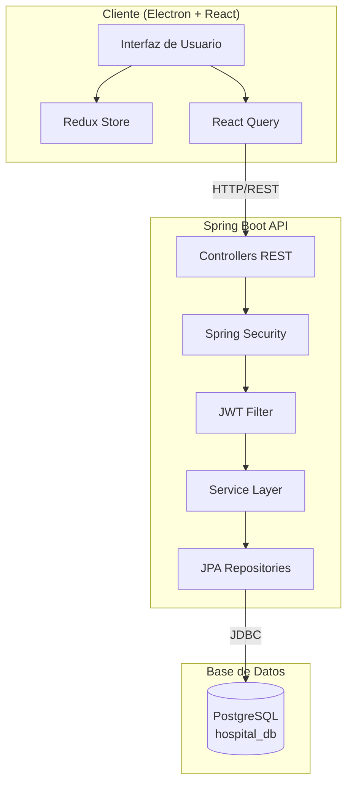
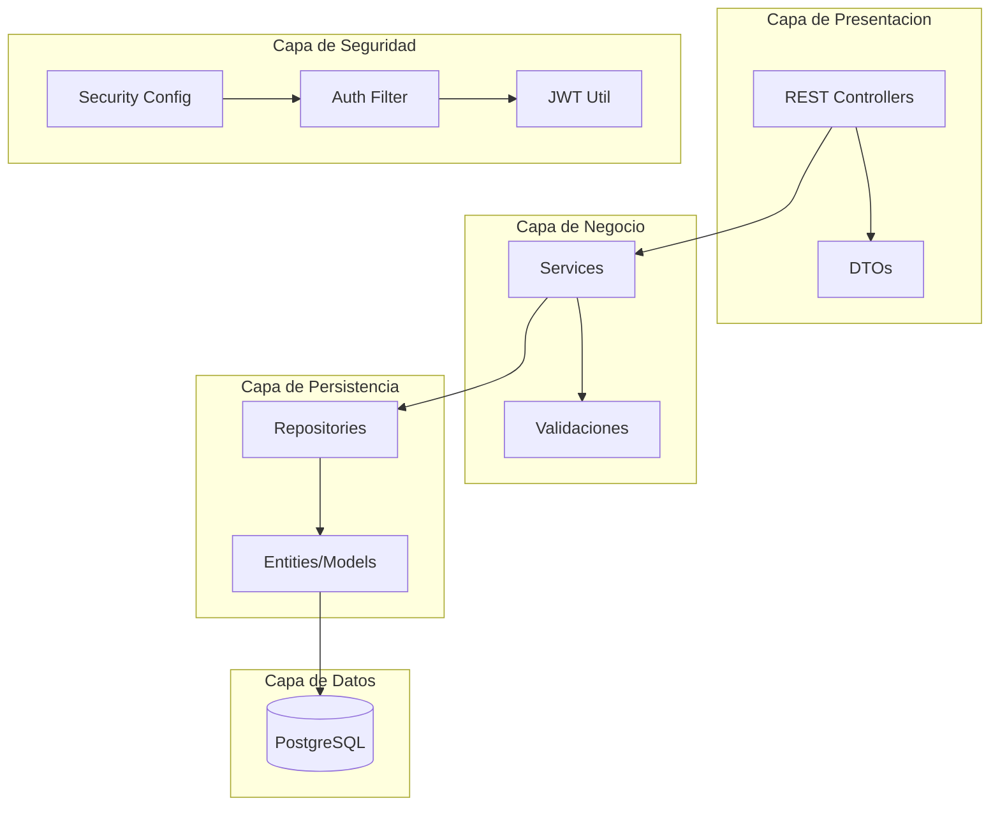
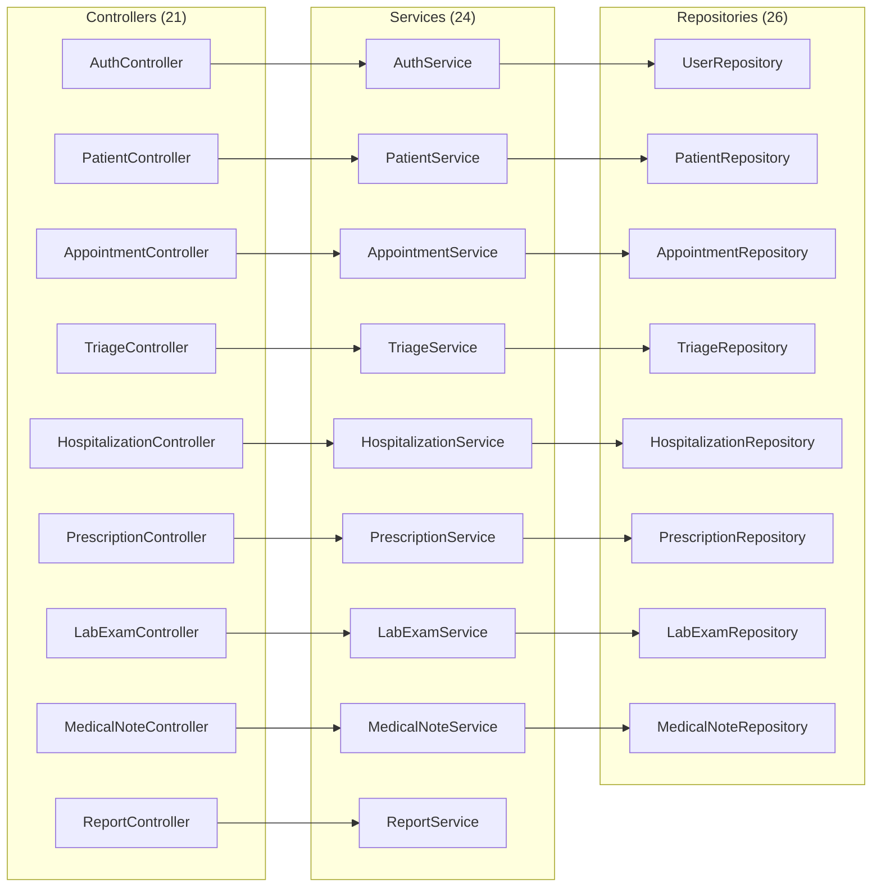
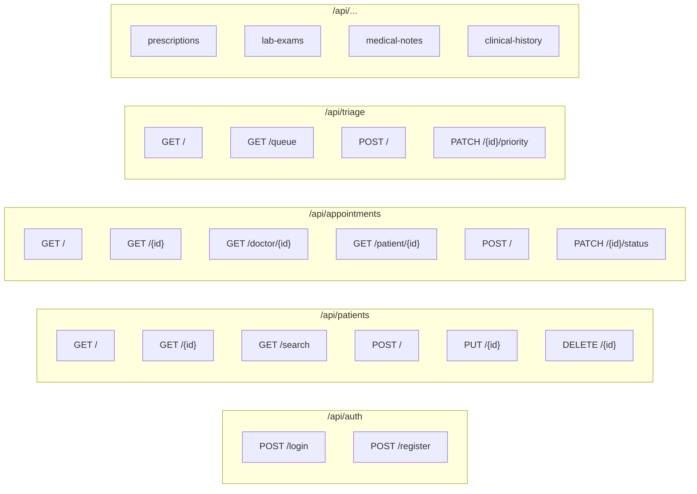
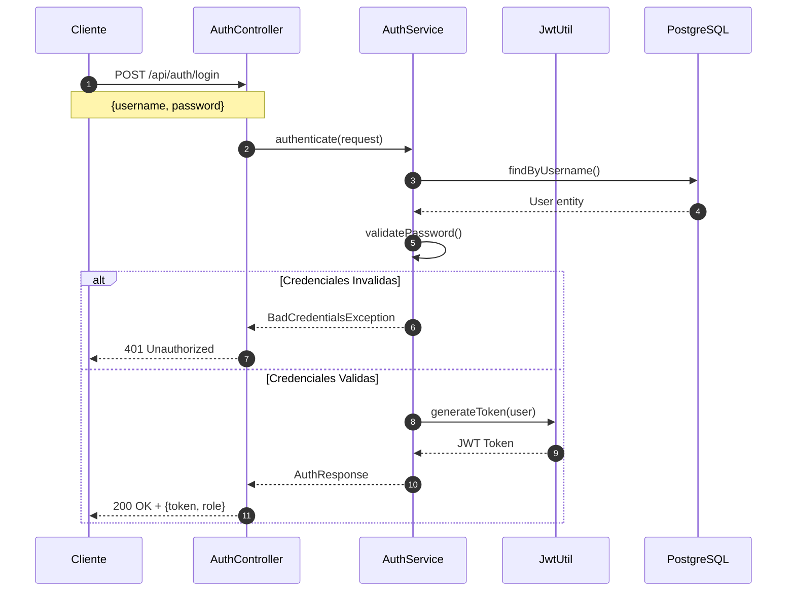
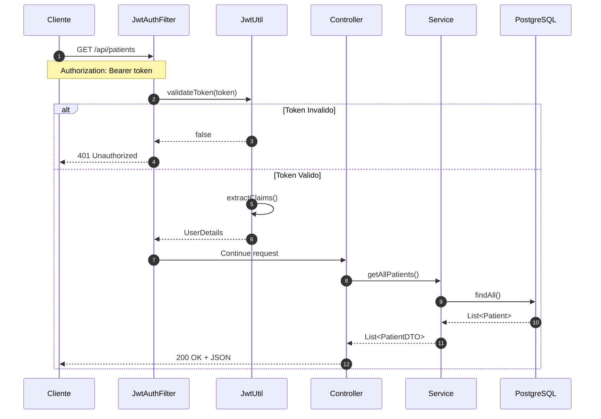
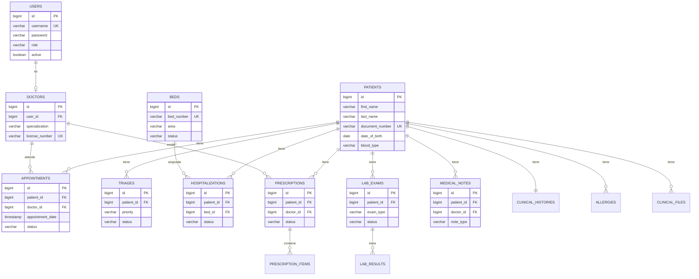
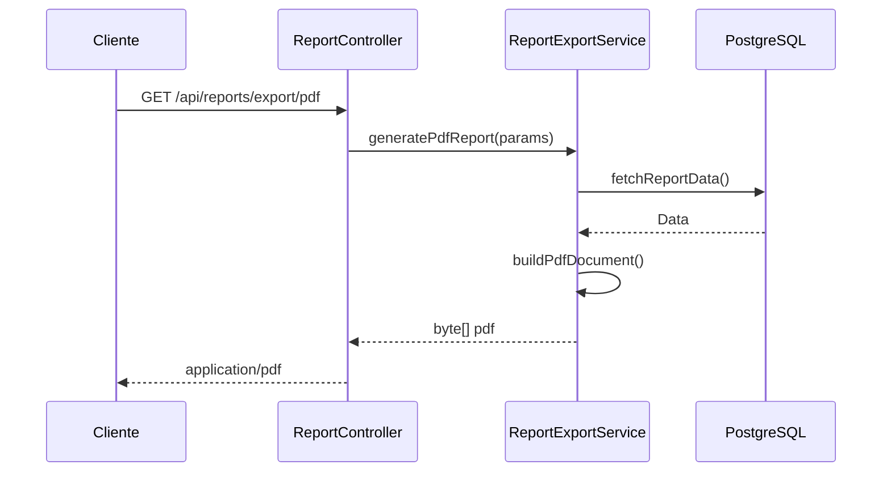

# Sistema Hospitalario - Backend API

<p align="center">
  
  
  
</p>

<p align="center">
  
  
  
  
  
</p>

<p align="center">
  <a href="https://github.com/Yonsn76/hospital-system-java">
    
  </a>
</p>

---

## Tabla de Contenidos

1. [Descripcion General](#descripcion-general)
2. [Arquitectura del Sistema](#arquitectura-del-sistema)
3. [Requisitos Previos](#requisitos-previos)
4. [Instalacion y Configuracion](#instalacion-y-configuracion)
5. [Estructura del Proyecto](#estructura-del-proyecto)
6. [Modulos del Sistema](#modulos-del-sistema)
7. [API Endpoints](#api-endpoints)
8. [Seguridad y Autenticacion](#seguridad-y-autenticacion)
9. [Base de Datos](#base-de-datos)
10. [Exportacion de Reportes](#exportacion-de-reportes)
11. [Comandos Utiles](#comandos-utiles)

---

## Descripcion General

API REST empresarial desarrollada con Spring Boot para la gestion integral de un sistema hospitalario. El sistema proporciona funcionalidades completas para la administracion de pacientes, citas medicas, hospitalizaciones, triaje, recetas, examenes de laboratorio, notas medicas y reportes clinicos.

### Caracteristicas Principales

| Caracteristica | Descripcion |
|----------------|-------------|
| Autenticacion JWT | Tokens seguros con expiracion configurable |
| Control de Acceso RBAC | Roles y permisos granulares por modulo |
| Gestion Clinica Completa | Pacientes, citas, hospitalizaciones, triaje |
| Expediente Electronico | Historial clinico, notas medicas, evoluciones |
| Laboratorio | Solicitud y seguimiento de examenes |
| Recetas Medicas | Prescripciones con control de estado |
| Reportes | Exportacion a PDF y Excel |
| Auditoria | Registro de accesos a expedientes |

---

## Arquitectura del Sistema



### Capas de la Aplicacion



### Organizacion Modular

El proyecto implementa una arquitectura basada en **Modulos Funcionales** (Vertical Slicing conceptual). Aunque se mantienen las capas tecnicas (Controller, Service, Repository), internamente cada una se organiza por dominio de negocio:

*   **Appointment**: Gestion del ciclo de vida de citas.
*   **Clinical**: Historia clinica, antecedentes y alergias.
*   **Patient**: Informacion demografica y administrativa de pacientes.
*   **Medical**: Notas de evolucion y prescripciones.
*   **Etc.**

Esta estructura mejora la cohesion del codigo y facilita el mantenimiento al agrupar clases relacionadas por su funcion de negocio.

---

## Requisitos Previos

| Componente | Version Minima | Recomendada |
|------------|----------------|-------------|
| Java JDK | 17 | 17 LTS |
| Maven | 3.8 | 3.9+ |
| PostgreSQL | 14 | 15+ |

<p align="center">
  
  
  
</p>

---

## Instalacion y Configuracion

### 1. Clonar el Repositorio

```bash
git clone https://github.com/Yonsn76/hospital-system-java.git
cd hospital-system-java/backend
```

### 2. Crear Base de Datos

```sql
CREATE DATABASE hospital_db;
```

Ejecutar los scripts de esquema:

```bash
psql -U postgres -d hospital_db -f database/schema.sql
psql -U postgres -d hospital_db -f database/clinical_schema.sql
psql -U postgres -d hospital_db -f database/seed_data.sql
```

### 3. Configurar Variables

Editar `src/main/resources/application.properties`:

```properties
# Servidor
server.port=2026

# Base de Datos
spring.datasource.url=jdbc:postgresql://localhost:5432/hospital_db
spring.datasource.username=postgres
spring.datasource.password=tu_password

# JWT (CAMBIAR EN PRODUCCION)
jwt.secret=tu_clave_secreta_muy_larga_y_segura_de_256_bits
jwt.expiration=86400000
```

### 4. Compilar y Ejecutar

```bash
# Compilar
mvn clean install

# Ejecutar
mvn spring-boot:run
```

La API estara disponible en: `http://localhost:2026`

---

## Estructura del Proyecto

```
backend/
├── database/
│   ├── schema.sql              # Esquema principal
│   ├── clinical_schema.sql     # Esquema clinico extendido
│   └── seed_data.sql           # Datos de prueba
│
├── src/main/java/com/hospital/system/
│   ├── config/                 # Configuraciones Globales
│   │
│   ├── controller/             # Controladores REST
│   │   ├── appointment/        # Modulo Citas
│   │   ├── auth/               # Modulo Autenticacion
│   │   ├── clinical/           # Modulo Historia Clinica
│   │   ├── files/              # Modulo Archivos
│   │   ├── hospitalization/    # Modulo Hospitalizacion
│   │   ├── lab/                # Modulo Laboratorio
│   │   ├── medical/            # Modulo Medico
│   │   ├── nursing/            # Modulo Enfermeria
│   │   ├── patient/            # Modulo Pacientes
│   │   ├── referral/           # Modulo Derivaciones
│   │   ├── report/             # Modulo Reportes
│   │   └── resource/           # Modulo Recursos
│   │
│   ├── dto/                    # Data Transfer Objects
│   │   ├── appointment/
│   │   ├── auth/
│   │   ├── clinical/
│   │   ├── files/
│   │   ├── hospitalization/
│   │   ├── lab/
│   │   ├── medical/
│   │   ├── nursing/
│   │   ├── patient/
│   │   ├── referral/
│   │   ├── report/
│   │   └── resource/
│   │
│   ├── model/                  # Entidades JPA
│   │   ├── appointment/
│   │   ├── auth/
│   │   ├── clinical/
│   │   ├── core/               # Entidades Base (Patient, Doctor)
│   │   ├── files/
│   │   ├── hospitalization/
│   │   ├── lab/
│   │   ├── medical/
│   │   ├── nursing/
│   │   ├── referral/
│   │   └── resource/
│   │
│   ├── repository/             # Repositorios JPA
│   │   ├── appointment/
│   │   ├── auth/
│   │   ├── clinical/
│   │   ├── core/
│   │   ├── files/
│   │   ├── hospitalization/
│   │   ├── lab/
│   │   ├── medical/
│   │   ├── nursing/
│   │   ├── patient/
│   │   ├── referral/
│   │   └── resource/
│   │
│   ├── security/               # Seguridad y JWT
│   │
│   ├── service/                # Logica de Negocio
│   │   ├── appointment/
│   │   ├── auth/
│   │   ├── clinical/
│   │   ├── files/
│   │   ├── hospitalization/
│   │   ├── lab/
│   │   ├── medical/
│   │   ├── nursing/
│   │   ├── patient/
│   │   ├── referral/
│   │   ├── report/
│   │   └── resource/
│   │
│   └── HospitalSystemApplication.java
│
├── src/main/resources/
│   └── application.properties
│
└── pom.xml
```

### Diagrama de Componentes



---

## Modulos del Sistema

### Gestion de Pacientes
| Funcionalidad | Descripcion |
|---------------|-------------|
| Registro | Alta de pacientes con datos demograficos |
| Busqueda | Por nombre, documento, telefono |
| Historial | Acceso al expediente clinico completo |

### Citas Medicas
| Funcionalidad | Descripcion |
|---------------|-------------|
| Programacion | Agendar citas con doctores |
| Estados | SCHEDULED, CONFIRMED, IN_PROGRESS, COMPLETED, CANCELLED |
| Filtros | Por doctor, paciente, fecha, estado |

### Triaje
| Funcionalidad | Descripcion |
|---------------|-------------|
| Clasificacion | Prioridad por gravedad |
| Signos Vitales | Registro de presion, temperatura, pulso |
| Cola de Atencion | Ordenamiento por prioridad |

### Hospitalizacion
| Funcionalidad | Descripcion |
|---------------|-------------|
| Ingreso | Admision de pacientes |
| Camas | Gestion de disponibilidad y asignacion |
| Transferencias | Movimiento entre areas |
| Alta | Registro de egreso con tipo de alta |

---

## API Endpoints

### Diagrama de Endpoints



### Autenticacion

| Metodo | Endpoint | Descripcion |
|--------|----------|-------------|
| POST | `/api/auth/login` | Iniciar sesion |
| POST | `/api/auth/register` | Registrar usuario |

### Pacientes `/api/patients`

| Metodo | Endpoint | Descripcion |
|--------|----------|-------------|
| GET | `/` | Listar todos |
| GET | `/{id}` | Obtener por ID |
| GET | `/search?query=` | Buscar pacientes |
| POST | `/` | Crear paciente |
| PUT | `/{id}` | Actualizar paciente |
| DELETE | `/{id}` | Eliminar paciente |

### Citas `/api/appointments`

| Metodo | Endpoint | Descripcion |
|--------|----------|-------------|
| GET | `/` | Listar todas |
| GET | `/{id}` | Obtener por ID |
| GET | `/doctor/{id}` | Por doctor |
| GET | `/patient/{id}` | Por paciente |
| POST | `/` | Crear cita |
| PATCH | `/{id}/status` | Cambiar estado |

### Triaje `/api/triage`

| Metodo | Endpoint | Descripcion |
|--------|----------|-------------|
| GET | `/` | Listar todos |
| GET | `/queue` | Cola de atencion |
| POST | `/` | Crear triaje |
| PATCH | `/{id}/priority` | Cambiar prioridad |

### Hospitalizacion `/api/hospitalizations`

| Metodo | Endpoint | Descripcion |
|--------|----------|-------------|
| GET | `/` | Listar activas |
| POST | `/` | Ingresar paciente |
| POST | `/{id}/discharge` | Dar de alta |
| POST | `/{id}/transfer` | Transferir cama |

### Recetas `/api/prescriptions`

| Metodo | Endpoint | Descripcion |
|--------|----------|-------------|
| GET | `/` | Listar todas |
| GET | `/patient/{id}` | Por paciente |
| POST | `/` | Crear receta |
| PATCH | `/{id}/status` | Cambiar estado |

### Laboratorio `/api/lab-exams`

| Metodo | Endpoint | Descripcion |
|--------|----------|-------------|
| GET | `/` | Listar todos |
| GET | `/pending` | Pendientes |
| POST | `/` | Solicitar examen |
| POST | `/{id}/results` | Cargar resultados |

### Reportes `/api/reports`

| Metodo | Endpoint | Descripcion |
|--------|----------|-------------|
| GET | `/statistics` | Estadisticas generales |
| GET | `/export/pdf` | Exportar a PDF |
| GET | `/export/excel` | Exportar a Excel |

---

## Seguridad y Autenticacion

### Roles del Sistema

| Rol | Descripcion | Nivel de Acceso |
|-----|-------------|-----------------|
| ADMIN | Administrador del sistema | Acceso total |
| DOCTOR | Medico | Pacientes, citas, notas, recetas |
| NURSE | Enfermera | Triaje, signos vitales, observaciones |
| RECEPTIONIST | Recepcionista | Pacientes, citas, admisiones |
| LAB_TECH | Tecnico laboratorio | Examenes, resultados |

### Flujo de Autenticacion



### Flujo de Peticion Autenticada



### Configuracion JWT

```properties
jwt.secret=clave_secreta_256_bits
jwt.expiration=86400000  # 24 horas en ms
```

---

## Base de Datos

### Diagrama Entidad-Relacion (Simplificado)



### Tablas Principales

| Tabla | Descripcion |
|-------|-------------|
| users | Usuarios del sistema |
| doctors | Informacion de medicos |
| patients | Datos de pacientes |
| appointments | Citas medicas |
| triages | Registros de triaje |
| hospitalizations | Ingresos hospitalarios |
| beds | Camas disponibles |
| prescriptions | Recetas medicas |
| prescription_items | Items de receta |
| lab_exams | Examenes de laboratorio |
| lab_results | Resultados de examenes |
| medical_notes | Notas medicas |
| clinical_histories | Historiales clinicos |
| clinical_files | Archivos clinicos |
| allergies | Alergias de pacientes |
| file_access_logs | Auditoria de accesos |

Ver diagrama completo en: [../diagrams/er_diagram.md](../diagrams/er_diagram.md)

---

## Exportacion de Reportes

### Dependencias

```xml
<!-- PDF - iText 7 -->
<dependency>
    <groupId>com.itextpdf</groupId>
    <artifactId>itext7-core</artifactId>
    <version>7.2.5</version>
</dependency>

<!-- Excel - Apache POI -->
<dependency>
    <groupId>org.apache.poi</groupId>
    <artifactId>poi-ooxml</artifactId>
    <version>5.2.5</version>
</dependency>
```

### Flujo de Exportacion



### Formatos Disponibles

| Formato | Endpoint | Content-Type |
|---------|----------|--------------|
| PDF | `/api/reports/export/pdf` | application/pdf |
| Excel | `/api/reports/export/excel` | application/vnd.openxmlformats-officedocument.spreadsheetml.sheet |

---

## Comandos Utiles

```bash
# Compilar sin tests
mvn clean install -DskipTests

# Ejecutar aplicacion
mvn spring-boot:run

# Ejecutar tests
mvn test

# Generar JAR
mvn clean package -DskipTests

# Ejecutar JAR
java -jar target/hospital-system-0.0.1-SNAPSHOT.jar

# Ver arbol de dependencias
mvn dependency:tree
```

---

## Notas de Produccion

| Aspecto | Recomendacion |
|---------|---------------|
| JWT Secret | Usar variable de entorno, minimo 256 bits |
| Base de Datos | Cambiar `ddl-auto` a `validate`, usar migraciones |
| HTTPS | Configurar SSL/TLS obligatorio |
| Logs | Configurar nivel apropiado, rotacion de archivos |
| Monitoreo | Integrar Spring Actuator |
| Backup | Configurar respaldos automaticos de BD |

---

<p align="center">
  
  <br/>
  Desarrollado con Spring Boot
</p>
