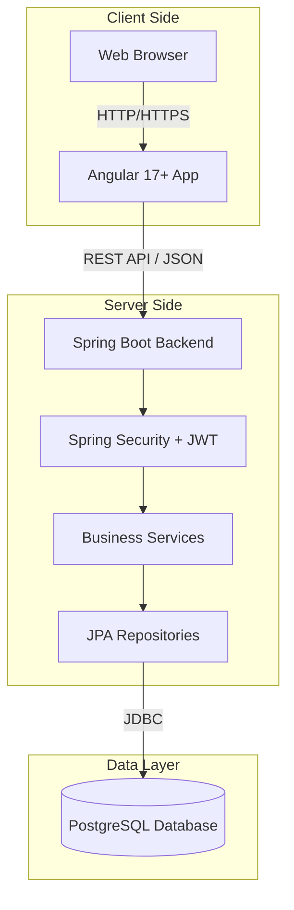

# System Architecture

```mermaid
graph TD
    subgraph Client [Client Side]
        Browser[Web Browser]
        Angular[Angular 17+ App]
    end

    subgraph Server [Server Side]
        SpringBoot[Spring Boot Backend]
        Security[Spring Security + JWT]
        Services[Business Services]
        Repo[JPA Repositories]
    end

    subgraph Data [Data Layer]
        PostgreSQL[(PostgreSQL Database)]
    end

    Browser -->|HTTP/HTTPS| Angular
    Angular -->|REST API / JSON| SpringBoot
    SpringBoot --> Security
    Security --> Services
    Services --> Repo
    Repo -->|JDBC| PostgreSQL
```
