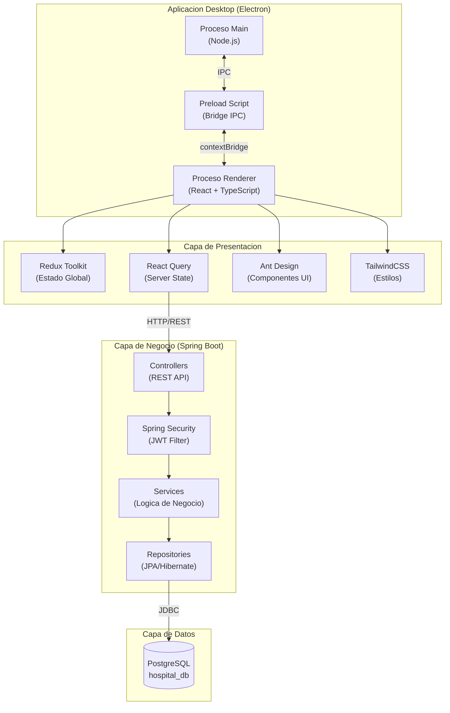
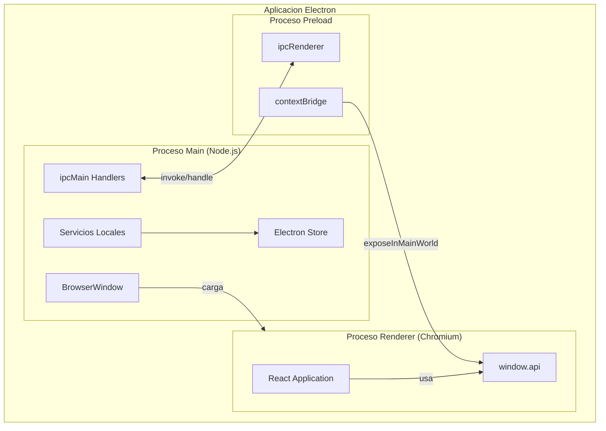
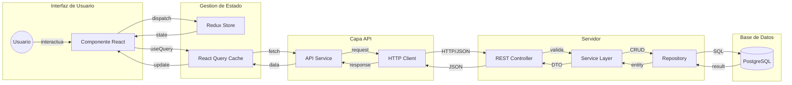
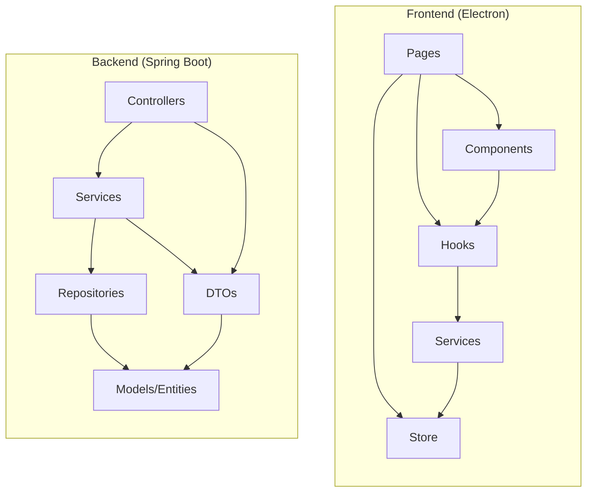

# Arquitectura del Sistema

<p align="center">
  
  
  
</p>

---

## Diagrama de Arquitectura General



---

## Arquitectura de Electron



---

## Flujo de Datos



---

## Arquitectura de Seguridad

```mermaid
graph TD
    subgraph Client ["Cliente (Electron)"]
        Login["Pantalla Login"]
        Token["Token Storage<br/>(Redux Persist)"]
        Interceptor["HTTP Interceptor"]
    end

    subgraph Server ["Servidor (Spring Boot)"]
        AuthController["AuthController"]
        JwtFilter["JwtAuthenticationFilter"]
        SecurityConfig["SecurityConfig"]
        AuthService["AuthService"]
        JwtUtil["JwtUtil"]
    end

    subgraph DB ["Base de Datos"]
        Users[("users")]
    end

    Login -->|POST /auth/login| AuthController
    AuthController --> AuthService
    AuthService -->|findByUsername| Users
    AuthService --> JwtUtil
    JwtUtil -->|generateToken| AuthController
    AuthController -->|JWT Token| Token
    
    Token --> Interceptor
    Interceptor -->|Authorization: Bearer| JwtFilter
    JwtFilter --> JwtUtil
    JwtUtil -->|validateToken| SecurityConfig
    SecurityConfig -->|@PreAuthorize| AuthService
```

---

## Capas del Sistema

| Capa | Tecnologia | Responsabilidad |
|------|------------|-----------------|
| Presentacion | Electron + React 18 + TypeScript | Interfaz de usuario multiplataforma |
| Estado | Redux Toolkit + React Query | Gestion de estado local y servidor |
| Comunicacion | Axios + IPC | Peticiones HTTP y comunicacion entre procesos |
| API | Spring Boot 3.2 | Endpoints REST y logica de negocio |
| Seguridad | Spring Security + JWT | Autenticacion y autorizacion |
| Persistencia | Spring Data JPA | Acceso a datos con Hibernate |
| Base de Datos | PostgreSQL 15 | Almacenamiento relacional |

---

## Puertos y Servicios

| Servicio | Puerto | Descripcion |
|----------|--------|-------------|
| Backend API | 2026 | Spring Boot REST API |
| PostgreSQL | 5432 | Base de datos |
| Electron Dev | 5173 | Vite dev server (desarrollo) |

---

## Dependencias entre Modulos


