# Diagrama Entidad-Relacion

<p align="center">
  
  
</p>

---

## Modelo de Datos Completo

```mermaid
erDiagram
    USERS {
        bigint id PK
        varchar username UK
        varchar password
        varchar email
        varchar role
        boolean active
        timestamp created_at
        timestamp updated_at
    }

    DOCTORS {
        bigint id PK
        bigint user_id FK
        varchar first_name
        varchar last_name
        varchar specialization
        varchar license_number UK
        varchar phone
        varchar email
        boolean active
    }

    PATIENTS {
        bigint id PK
        varchar first_name
        varchar last_name
        varchar document_number UK
        varchar document_type
        date date_of_birth
        varchar gender
        varchar blood_type
        varchar phone
        varchar email
        varchar address
        varchar emergency_contact
        varchar emergency_phone
        timestamp created_at
    }

    APPOINTMENTS {
        bigint id PK
        bigint patient_id FK
        bigint doctor_id FK
        timestamp appointment_date
        varchar status
        varchar reason
        text notes
        timestamp created_at
        timestamp updated_at
    }

    TRIAGES {
        bigint id PK
        bigint patient_id FK
        bigint nurse_id FK
        varchar priority
        varchar status
        text chief_complaint
        text observations
        timestamp created_at
    }

    VITAL_SIGNS {
        bigint id PK
        bigint triage_id FK
        bigint patient_id FK
        decimal temperature
        integer systolic_pressure
        integer diastolic_pressure
        integer heart_rate
        integer respiratory_rate
        integer oxygen_saturation
        decimal weight
        decimal height
        timestamp recorded_at
    }

    HOSPITALIZATIONS {
        bigint id PK
        bigint patient_id FK
        bigint doctor_id FK
        bigint bed_id FK
        timestamp admission_date
        timestamp discharge_date
        varchar status
        varchar discharge_type
        text admission_reason
        text discharge_notes
    }

    BEDS {
        bigint id PK
        varchar bed_number UK
        varchar area
        varchar status
        varchar bed_type
    }

    PRESCRIPTIONS {
        bigint id PK
        bigint patient_id FK
        bigint doctor_id FK
        bigint appointment_id FK
        varchar status
        text diagnosis
        text instructions
        timestamp created_at
        timestamp expires_at
    }

    PRESCRIPTION_ITEMS {
        bigint id PK
        bigint prescription_id FK
        varchar medication_name
        varchar dosage
        varchar frequency
        varchar duration
        text instructions
        integer quantity
    }

    LAB_EXAMS {
        bigint id PK
        bigint patient_id FK
        bigint doctor_id FK
        varchar exam_type
        varchar priority
        varchar status
        text clinical_indication
        timestamp requested_at
        timestamp completed_at
    }

    LAB_RESULTS {
        bigint id PK
        bigint lab_exam_id FK
        varchar parameter_name
        varchar value
        varchar unit
        varchar reference_range
        boolean is_abnormal
    }

    MEDICAL_NOTES {
        bigint id PK
        bigint patient_id FK
        bigint doctor_id FK
        bigint appointment_id FK
        varchar note_type
        text subjective
        text objective
        text assessment
        text plan
        timestamp created_at
        integer version
    }

    CLINICAL_HISTORIES {
        bigint id PK
        bigint patient_id FK
        text personal_history
        text family_history
        text surgical_history
        text obstetric_history
        text social_history
        timestamp updated_at
    }

    ALLERGIES {
        bigint id PK
        bigint patient_id FK
        varchar allergen
        varchar severity
        varchar reaction
        timestamp recorded_at
    }

    CHRONIC_DISEASES {
        bigint id PK
        bigint patient_id FK
        varchar disease_name
        date diagnosis_date
        varchar status
        text treatment
    }

    CLINICAL_FILES {
        bigint id PK
        bigint patient_id FK
        bigint uploaded_by FK
        varchar file_name
        varchar file_type
        varchar file_path
        bigint file_size
        text description
        timestamp uploaded_at
    }

    FILE_ACCESS_LOGS {
        bigint id PK
        bigint clinical_file_id FK
        bigint user_id FK
        varchar action
        timestamp accessed_at
        varchar ip_address
    }

    NURSING_OBSERVATIONS {
        bigint id PK
        bigint patient_id FK
        bigint nurse_id FK
        bigint hospitalization_id FK
        text observation
        varchar observation_type
        timestamp created_at
    }

    REFERRALS {
        bigint id PK
        bigint patient_id FK
        bigint referring_doctor_id FK
        bigint receiving_doctor_id FK
        varchar referral_type
        varchar specialty
        varchar status
        varchar priority
        text reason
        text clinical_summary
        timestamp created_at
    }

    MODULE_PERMISSIONS {
        bigint id PK
        varchar role
        bigint user_id FK
        varchar module_id
        boolean is_additional
        boolean is_removed
    }

    %% Relaciones de Usuario
    USERS ||--o| DOCTORS : "es"
    
    %% Relaciones de Paciente
    PATIENTS ||--o{ APPOINTMENTS : "tiene"
    PATIENTS ||--o{ TRIAGES : "tiene"
    PATIENTS ||--o{ VITAL_SIGNS : "tiene"
    PATIENTS ||--o{ HOSPITALIZATIONS : "tiene"
    PATIENTS ||--o{ PRESCRIPTIONS : "tiene"
    PATIENTS ||--o{ LAB_EXAMS : "tiene"
    PATIENTS ||--o{ MEDICAL_NOTES : "tiene"
    PATIENTS ||--|| CLINICAL_HISTORIES : "tiene"
    PATIENTS ||--o{ ALLERGIES : "tiene"
    PATIENTS ||--o{ CHRONIC_DISEASES : "tiene"
    PATIENTS ||--o{ CLINICAL_FILES : "tiene"
    PATIENTS ||--o{ NURSING_OBSERVATIONS : "tiene"
    PATIENTS ||--o{ REFERRALS : "tiene"

    %% Relaciones de Doctor
    DOCTORS ||--o{ APPOINTMENTS : "atiende"
    DOCTORS ||--o{ HOSPITALIZATIONS : "supervisa"
    DOCTORS ||--o{ PRESCRIPTIONS : "emite"
    DOCTORS ||--o{ LAB_EXAMS : "solicita"
    DOCTORS ||--o{ MEDICAL_NOTES : "escribe"
    DOCTORS ||--o{ REFERRALS : "refiere"
    DOCTORS ||--o{ REFERRALS : "recibe"

    %% Relaciones de Triaje
    TRIAGES ||--o{ VITAL_SIGNS : "registra"
    USERS ||--o{ TRIAGES : "realiza"

    %% Relaciones de Hospitalizacion
    BEDS ||--o{ HOSPITALIZATIONS : "asignada"
    HOSPITALIZATIONS ||--o{ NURSING_OBSERVATIONS : "tiene"

    %% Relaciones de Prescripcion
    PRESCRIPTIONS ||--o{ PRESCRIPTION_ITEMS : "contiene"
    APPOINTMENTS ||--o{ PRESCRIPTIONS : "genera"

    %% Relaciones de Laboratorio
    LAB_EXAMS ||--o{ LAB_RESULTS : "tiene"

    %% Relaciones de Notas Medicas
    APPOINTMENTS ||--o{ MEDICAL_NOTES : "genera"

    %% Relaciones de Archivos
    CLINICAL_FILES ||--o{ FILE_ACCESS_LOGS : "registra"
    USERS ||--o{ FILE_ACCESS_LOGS : "accede"
    USERS ||--o{ CLINICAL_FILES : "sube"

    %% Relaciones de Enfermeria
    USERS ||--o{ NURSING_OBSERVATIONS : "registra"

    %% Relaciones de Permisos
    USERS ||--o{ MODULE_PERMISSIONS : "tiene"
```



---

## Tablas por Modulo

### Modulo de Usuarios y Autenticacion

| Tabla | Descripcion |
|-------|-------------|
| users | Credenciales y roles del sistema |
| doctors | Informacion profesional de medicos |
| module_permissions | Permisos personalizados por usuario/rol |

### Modulo de Pacientes

| Tabla | Descripcion |
|-------|-------------|
| patients | Datos demograficos y contacto |
| clinical_histories | Antecedentes medicos |
| allergies | Alergias registradas |
| chronic_diseases | Enfermedades cronicas |

### Modulo de Citas

| Tabla | Descripcion |
|-------|-------------|
| appointments | Programacion de citas |

### Modulo de Triaje

| Tabla | Descripcion |
|-------|-------------|
| triages | Evaluacion inicial de urgencias |
| vital_signs | Signos vitales del paciente |

### Modulo de Hospitalizacion

| Tabla | Descripcion |
|-------|-------------|
| hospitalizations | Ingresos y egresos |
| beds | Inventario de camas |
| nursing_observations | Notas de enfermeria |

### Modulo Clinico

| Tabla | Descripcion |
|-------|-------------|
| medical_notes | Notas medicas (SOAP) |
| prescriptions | Recetas medicas |
| prescription_items | Medicamentos de la receta |
| lab_exams | Ordenes de laboratorio |
| lab_results | Resultados de examenes |
| referrals | Derivaciones a especialistas |

### Modulo de Archivos

| Tabla | Descripcion |
|-------|-------------|
| clinical_files | Documentos adjuntos |
| file_access_logs | Auditoria de accesos |

---

## Indices Recomendados

```sql
-- Busqueda de pacientes
CREATE INDEX idx_patients_document ON patients(document_number);
CREATE INDEX idx_patients_name ON patients(last_name, first_name);

-- Citas por fecha
CREATE INDEX idx_appointments_date ON appointments(appointment_date);
CREATE INDEX idx_appointments_patient ON appointments(patient_id);
CREATE INDEX idx_appointments_doctor ON appointments(doctor_id);

-- Triaje por prioridad
CREATE INDEX idx_triages_priority ON triages(priority, status);
CREATE INDEX idx_triages_patient ON triages(patient_id);

-- Hospitalizaciones activas
CREATE INDEX idx_hospitalizations_status ON hospitalizations(status);
CREATE INDEX idx_hospitalizations_patient ON hospitalizations(patient_id);

-- Camas disponibles
CREATE INDEX idx_beds_status ON beds(status, area);

-- Prescripciones activas
CREATE INDEX idx_prescriptions_status ON prescriptions(status);
CREATE INDEX idx_prescriptions_patient ON prescriptions(patient_id);

-- Examenes pendientes
CREATE INDEX idx_lab_exams_status ON lab_exams(status, priority);

-- Auditoria
CREATE INDEX idx_file_access_logs_file ON file_access_logs(clinical_file_id);
CREATE INDEX idx_file_access_logs_user ON file_access_logs(user_id);
```

---

## Enumeraciones (Enums)

### Estados de Cita (AppointmentStatus)

| Valor | Descripcion |
|-------|-------------|
| SCHEDULED | Programada |
| CONFIRMED | Confirmada |
| IN_PROGRESS | En atencion |
| COMPLETED | Completada |
| CANCELLED | Cancelada |
| NO_SHOW | No se presento |

### Prioridad de Triaje (TriagePriority)

| Valor | Color | Descripcion |
|-------|-------|-------------|
| RESUSCITATION | Rojo | Reanimacion inmediata |
| EMERGENCY | Naranja | Emergencia |
| URGENT | Amarillo | Urgente |
| LESS_URGENT | Verde | Menos urgente |
| NON_URGENT | Azul | No urgente |

### Estado de Triaje (TriageStatus)

| Valor | Descripcion |
|-------|-------------|
| WAITING | En espera |
| IN_PROGRESS | En atencion |
| COMPLETED | Completado |
| TRANSFERRED | Transferido |

### Estado de Cama (BedStatus)

| Valor | Descripcion |
|-------|-------------|
| AVAILABLE | Disponible |
| OCCUPIED | Ocupada |
| MAINTENANCE | En mantenimiento |
| RESERVED | Reservada |

### Estado de Prescripcion (PrescriptionStatus)

| Valor | Descripcion |
|-------|-------------|
| ACTIVE | Activa |
| DISPENSED | Dispensada |
| CANCELLED | Cancelada |
| EXPIRED | Expirada |

### Prioridad de Laboratorio (LabPriority)

| Valor | Descripcion |
|-------|-------------|
| ROUTINE | Rutina |
| URGENT | Urgente |
| STAT | Inmediato |

### Tipo de Nota Medica (MedicalNoteType)

| Valor | Descripcion |
|-------|-------------|
| CONSULTATION | Consulta |
| EVOLUTION | Evolucion |
| INTERCONSULTATION | Interconsulta |
| DISCHARGE | Egreso |

### Roles de Usuario (UserRole)

| Valor | Descripcion |
|-------|-------------|
| ADMIN | Administrador |
| DOCTOR | Medico |
| NURSE | Enfermera |
| RECEPTIONIST | Recepcionista |
| LAB_TECH | Tecnico de laboratorio |
