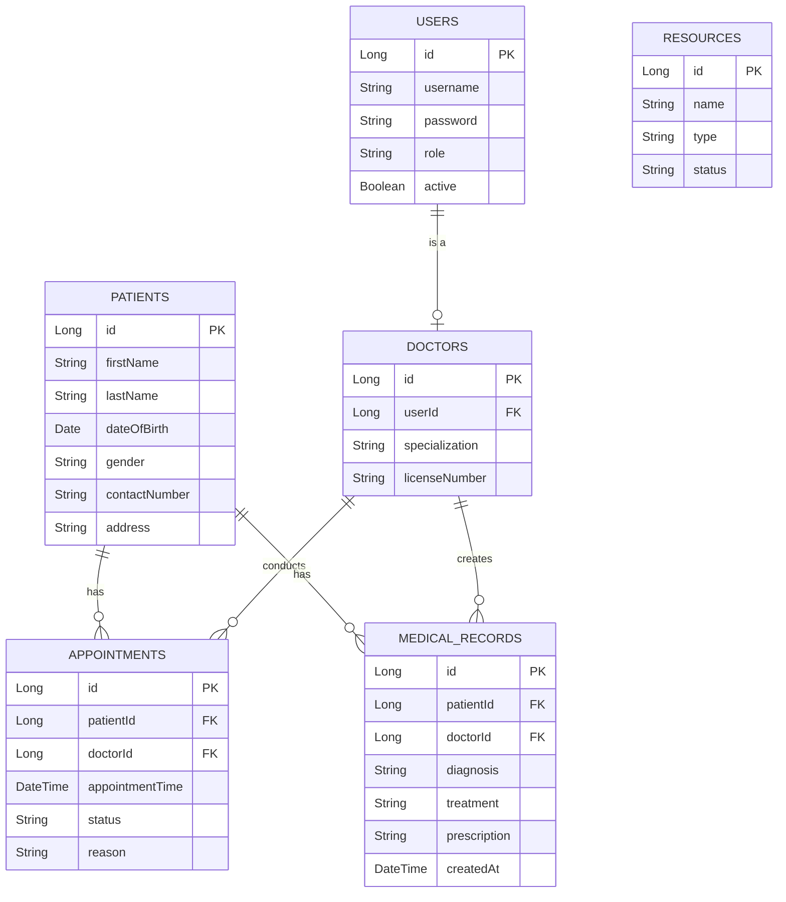

# Database ER Diagram

```mermaid
erDiagram
    USERS {
        Long id PK
        String username
        String password
        String role
        Boolean active
    }

    PATIENTS {
        Long id PK
        String firstName
        String lastName
        Date dateOfBirth
        String gender
        String contactNumber
        String address
    }

    DOCTORS {
        Long id PK
        Long userId FK
        String specialization
        String licenseNumber
    }

    APPOINTMENTS {
        Long id PK
        Long patientId FK
        Long doctorId FK
        DateTime appointmentTime
        String status
        String reason
    }

    MEDICAL_RECORDS {
        Long id PK
        Long patientId FK
        Long doctorId FK
        String diagnosis
        String treatment
        String prescription
        DateTime createdAt
    }

    RESOURCES {
        Long id PK
        String name
        String type
        String status
    }

    USERS ||--o| DOCTORS : "is a"
    PATIENTS ||--o{ APPOINTMENTS : "has"
    DOCTORS ||--o{ APPOINTMENTS : "conducts"
    PATIENTS ||--o{ MEDICAL_RECORDS : "has"
    DOCTORS ||--o{ MEDICAL_RECORDS : "creates"
```
