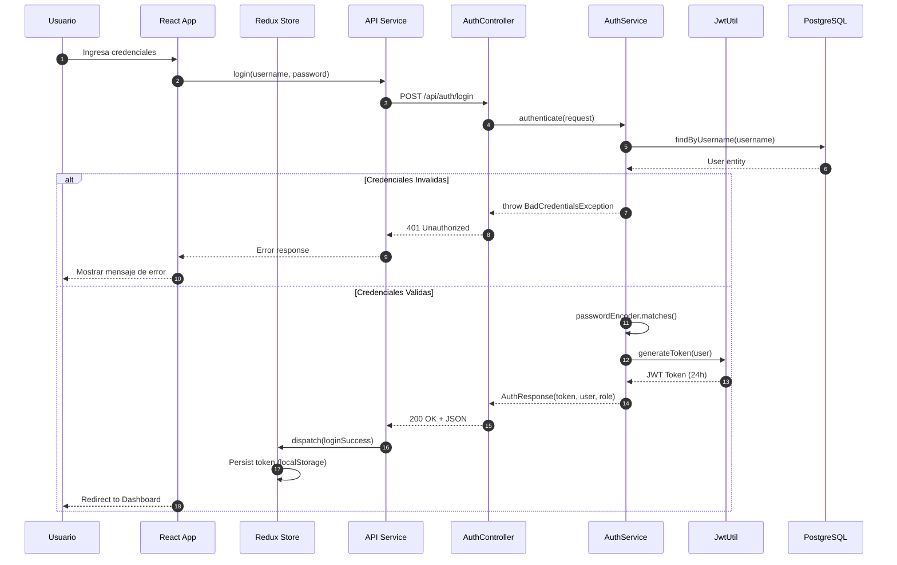
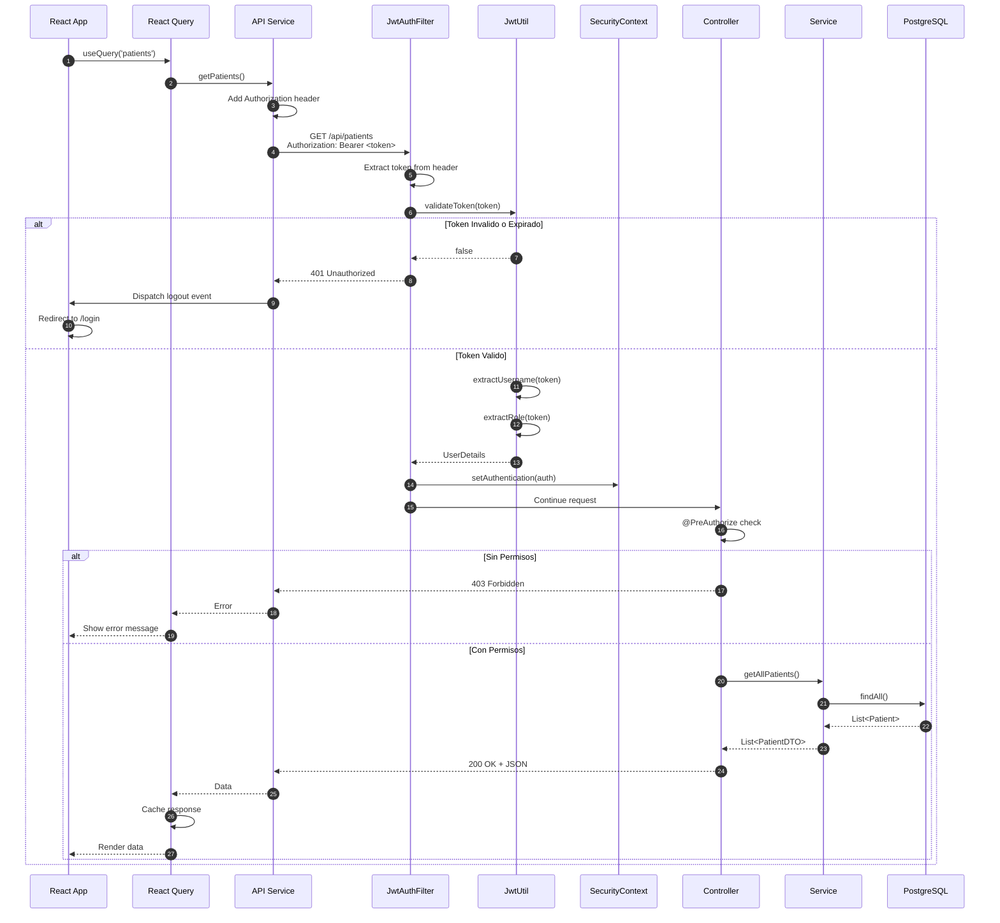
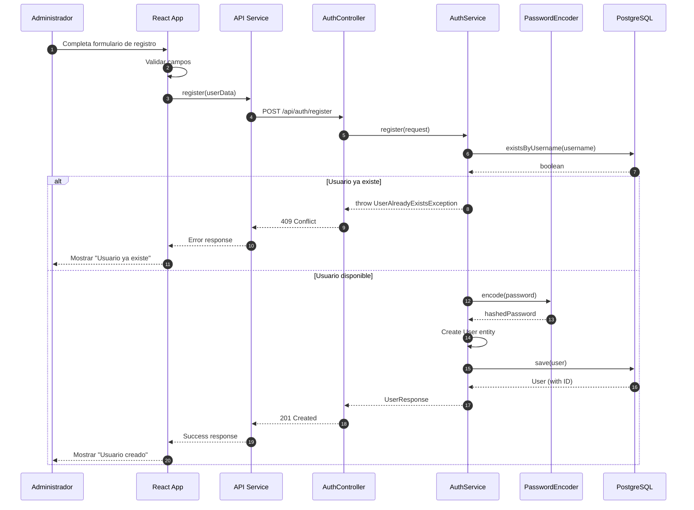
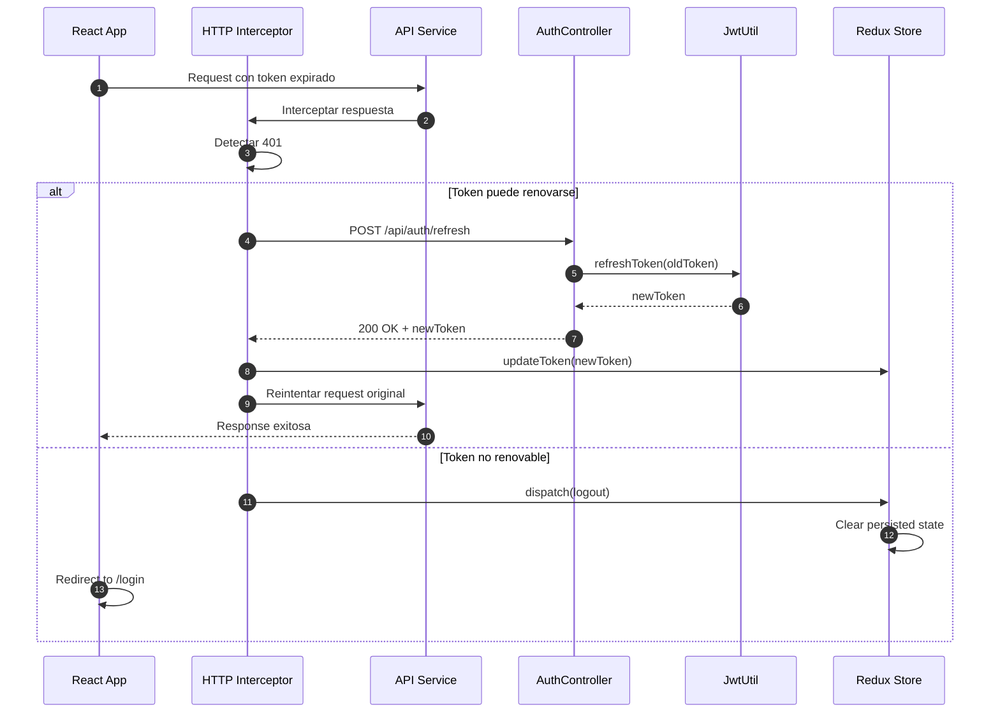
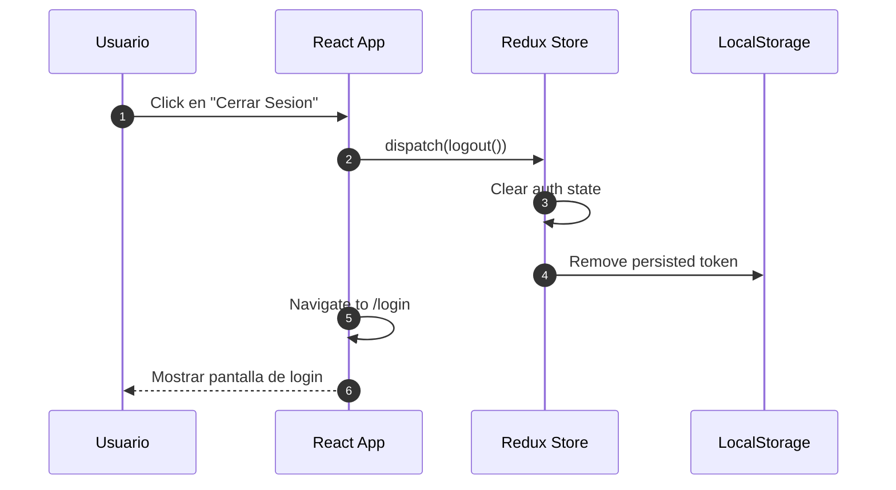

# Flujo de Autenticacion

<p align="center">
  
  
</p>

---

## Diagrama de Secuencia - Login



---

## Diagrama de Secuencia - Peticion Autenticada



---

## Diagrama de Secuencia - Registro de Usuario



---

## Diagrama de Secuencia - Refresh Token (Opcional)



---

## Estructura del Token JWT

```
Header.Payload.Signature
```

### Header

```json
{
  "alg": "HS256",
  "typ": "JWT"
}
```

### Payload

```json
{
  "sub": "username",
  "role": "DOCTOR",
  "userId": 123,
  "iat": 1701619200,
  "exp": 1701705600
}
```

### Claims Utilizados

| Claim | Descripcion |
|-------|-------------|
| sub | Username del usuario |
| role | Rol del usuario (ADMIN, DOCTOR, NURSE, etc.) |
| userId | ID del usuario en la base de datos |
| iat | Timestamp de emision |
| exp | Timestamp de expiracion (24 horas) |

---

## Configuracion de Seguridad

### Endpoints Publicos

| Endpoint | Metodo | Descripcion |
|----------|--------|-------------|
| /api/auth/login | POST | Iniciar sesion |
| /api/auth/register | POST | Registrar usuario |

### Endpoints Protegidos por Rol

| Endpoint | Roles Permitidos |
|----------|------------------|
| /api/patients/** | ADMIN, DOCTOR, NURSE, RECEPTIONIST |
| /api/appointments/** | ADMIN, DOCTOR, NURSE, RECEPTIONIST |
| /api/triage/** | ADMIN, DOCTOR, NURSE |
| /api/prescriptions/** | ADMIN, DOCTOR |
| /api/lab-exams/** | ADMIN, DOCTOR, NURSE, LAB_TECH |
| /api/medical-notes/** | ADMIN, DOCTOR |
| /api/reports/** | ADMIN, DOCTOR |
| /api/users/** | ADMIN |
| /api/permissions/** | ADMIN |

---

## Manejo de Errores de Autenticacion

| Codigo | Error | Causa | Accion del Cliente |
|--------|-------|-------|-------------------|
| 401 | Unauthorized | Token invalido, expirado o ausente | Redirigir a login |
| 403 | Forbidden | Usuario sin permisos para el recurso | Mostrar mensaje de acceso denegado |
| 409 | Conflict | Usuario ya existe (registro) | Mostrar mensaje de error |

---

## Flujo de Logout



---

## Notas de Seguridad

| Aspecto | Implementacion |
|---------|----------------|
| Almacenamiento de Token | Redux Persist con localStorage |
| Expiracion | 24 horas (configurable) |
| Algoritmo | HS256 (HMAC-SHA256) |
| Secret Key | Minimo 256 bits, variable de entorno |
| Password Hashing | BCrypt con salt |
| CORS | Configurado para origenes permitidos |
| HTTPS | Requerido en produccion |
