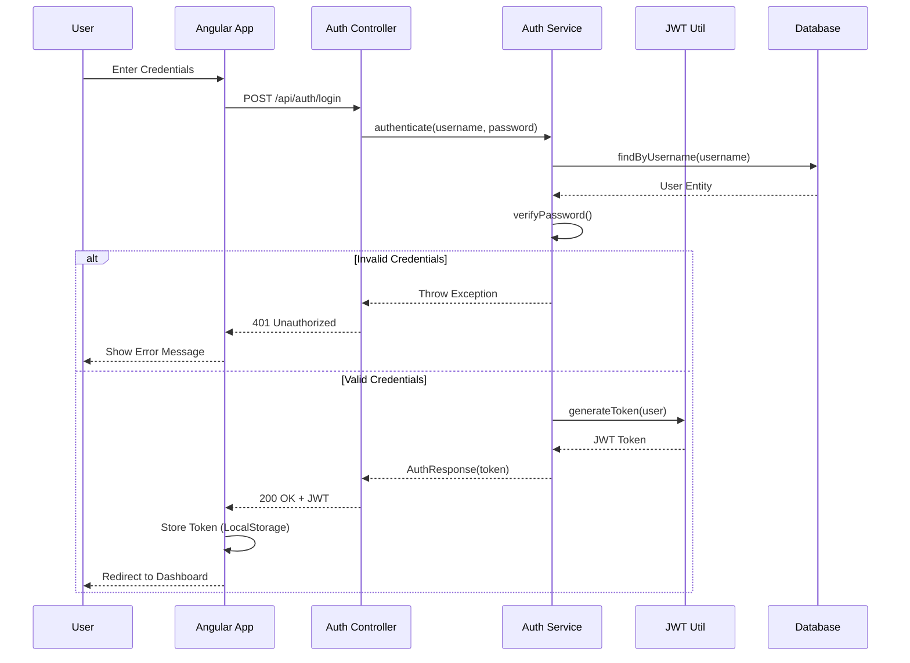

# Authentication Sequence

```mermaid
sequenceDiagram
    participant User
    participant Angular as Angular App
    participant AuthCtrl as Auth Controller
    participant AuthService as Auth Service
    participant JWT as JWT Util
    participant DB as Database

    User->>Angular: Enter Credentials
    Angular->>AuthCtrl: POST /api/auth/login
    AuthCtrl->>AuthService: authenticate(username, password)
    AuthService->>DB: findByUsername(username)
    DB-->>AuthService: User Entity
    AuthService->>AuthService: verifyPassword()
    
    alt Invalid Credentials
        AuthService-->>AuthCtrl: Throw Exception
        AuthCtrl-->>Angular: 401 Unauthorized
        Angular-->>User: Show Error Message
    else Valid Credentials
        AuthService->>JWT: generateToken(user)
        JWT-->>AuthService: JWT Token
        AuthService-->>AuthCtrl: AuthResponse(token)
        AuthCtrl-->>Angular: 200 OK + JWT
        Angular->>Angular: Store Token (LocalStorage)
        Angular-->>User: Redirect to Dashboard
    end
```
