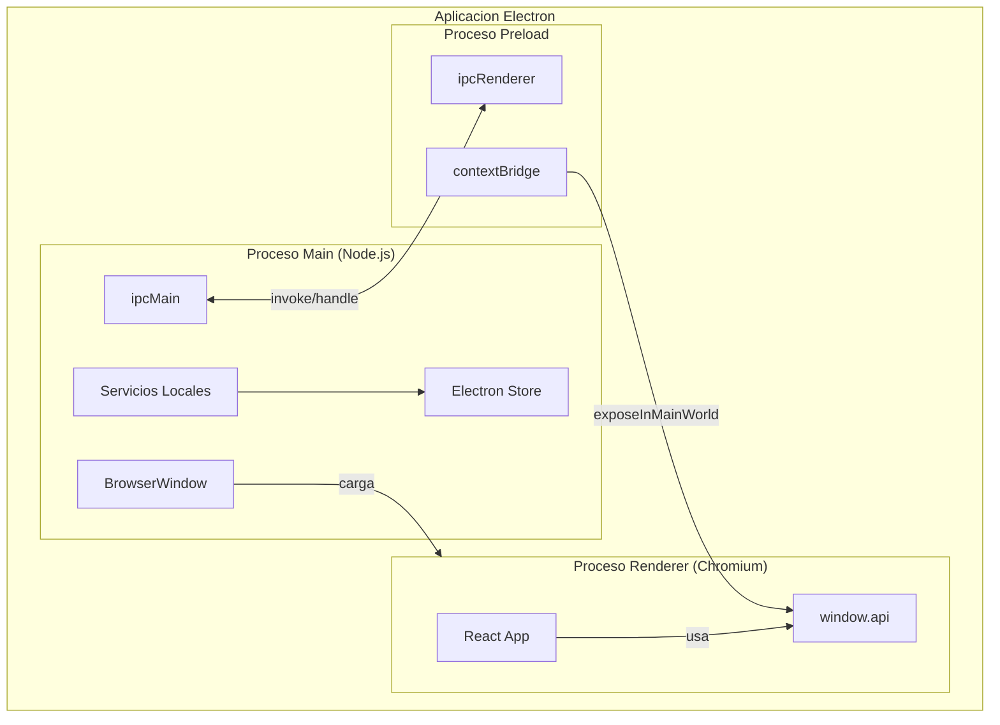
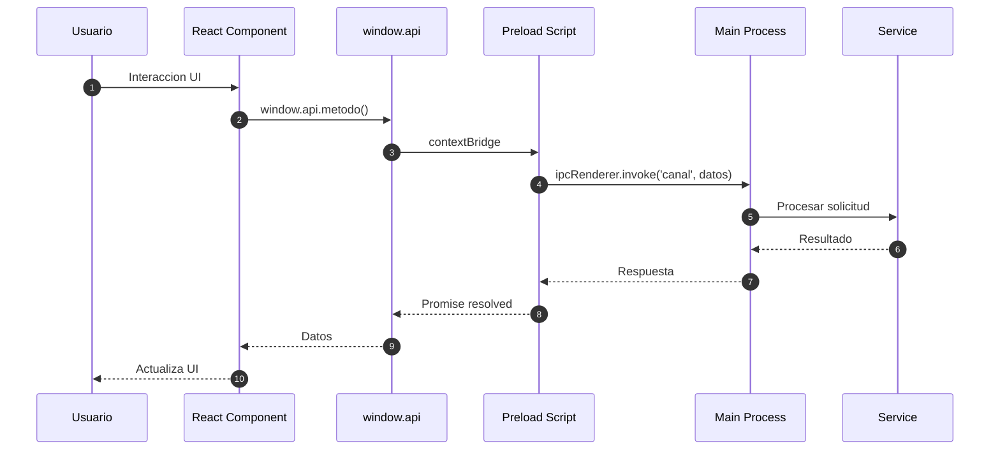
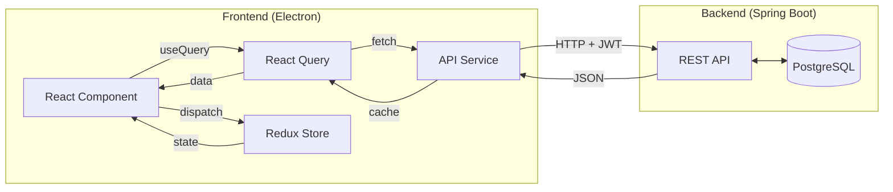
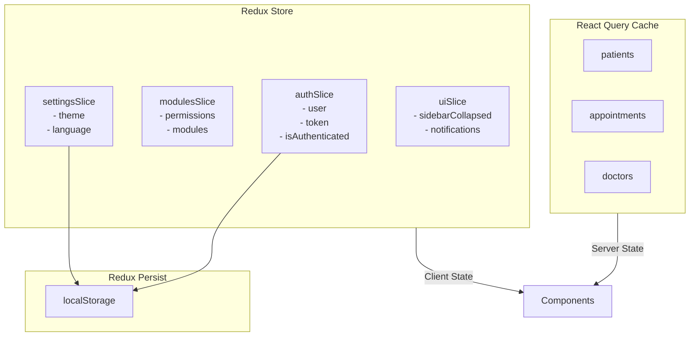
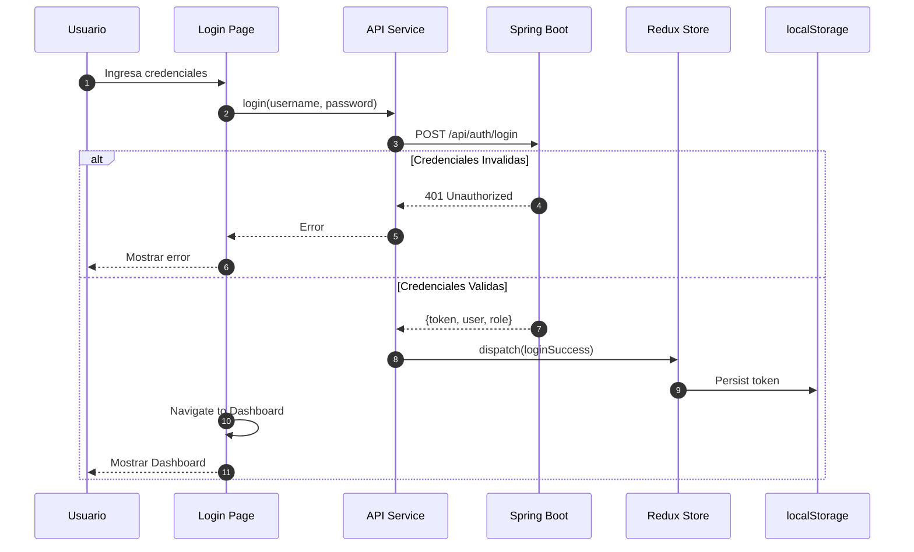
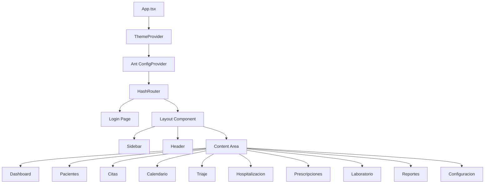
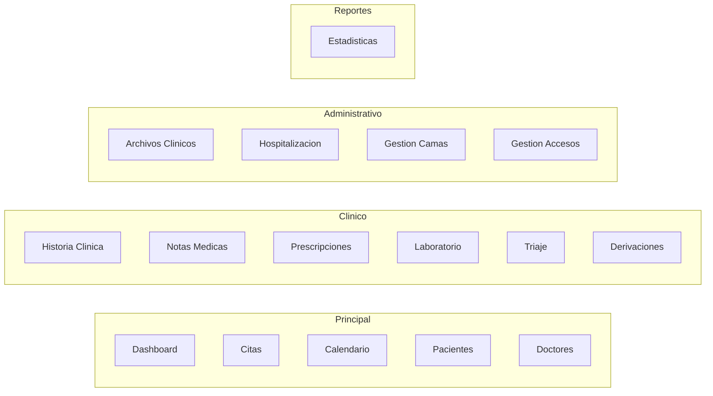
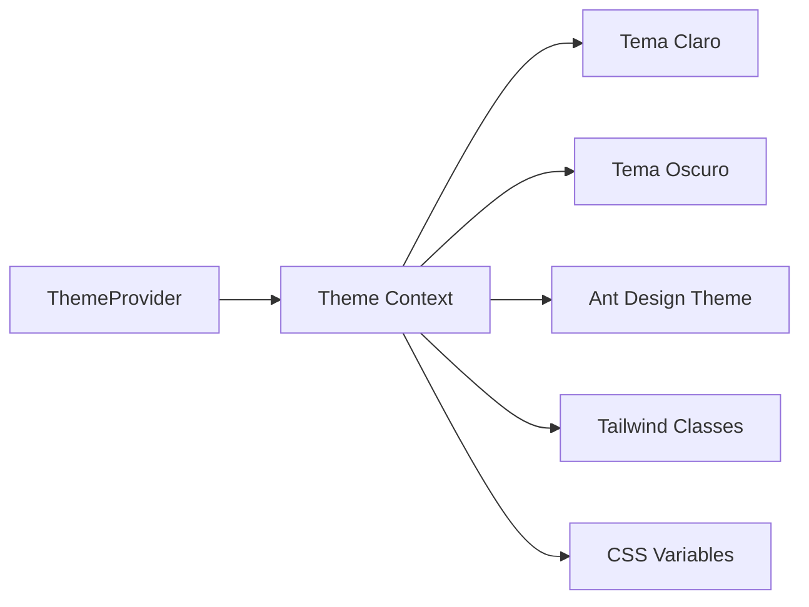
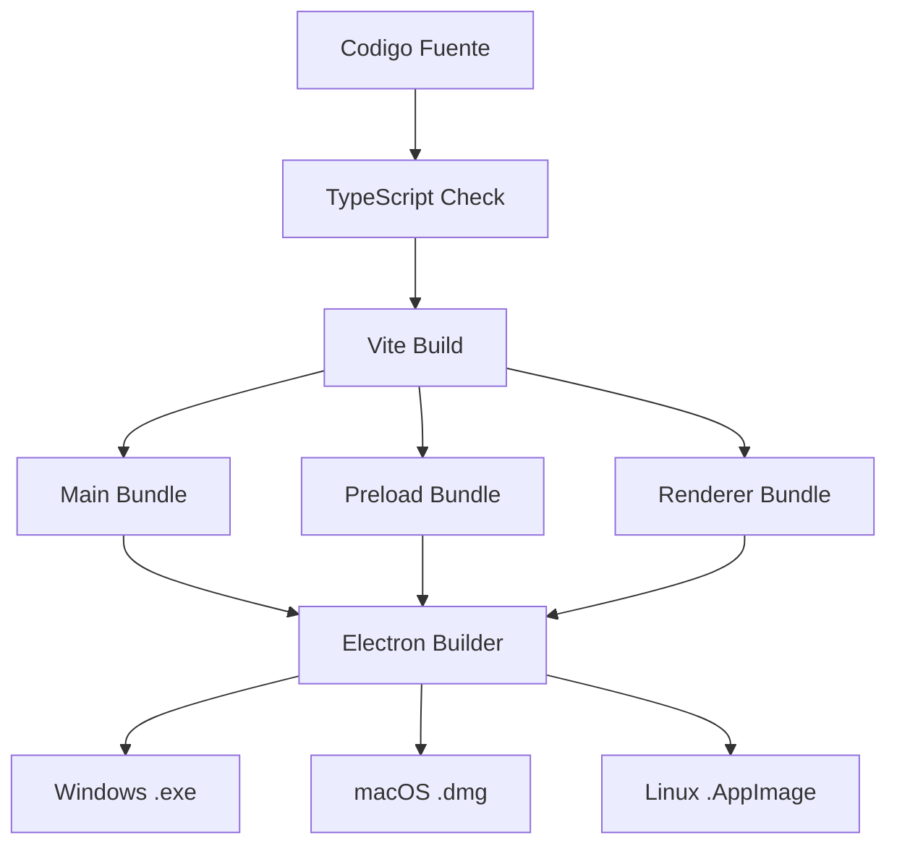

# Sistema de Gestion Hospitalaria - Frontend

<p align="center">
  
  
  
  
</p>

<p align="center">
  Aplicacion de escritorio multiplataforma para la gestion integral de centros de salud y hospitales.
  <br>
  Desarrollada con Electron, React y TypeScript.
</p>

---

## Tabla de Contenidos

- [Descripcion General](#descripcion-general)
- [Caracteristicas](#caracteristicas)
- [Stack Tecnologico](#stack-tecnologico)
- [Requisitos Previos](#requisitos-previos)
- [Instalacion](#instalacion)
- [Scripts Disponibles](#scripts-disponibles)
- [Estructura del Proyecto](#estructura-del-proyecto)
- [Arquitectura](#arquitectura)
- [Modulos del Sistema](#modulos-del-sistema)
- [Configuracion](#configuracion)
- [Compilacion y Distribucion](#compilacion-y-distribucion)
- [Licencia](#licencia)

---

## Descripcion General

Este proyecto es el frontend del Sistema de Gestion Hospitalaria, una aplicacion de escritorio que permite administrar de forma eficiente todas las operaciones de un centro de salud. La aplicacion se conecta a un backend REST API desarrollado en Spring Boot para la persistencia y logica de negocio.

---

## Caracteristicas

### Modulos Principales
- Gestion completa de pacientes (registro, busqueda, historial)
- Administracion de doctores y especialidades medicas
- Programacion y seguimiento de citas medicas
- Calendario visual interactivo de citas

### Modulos Clinicos
- Historia clinica electronica
- Notas medicas y observaciones
- Prescripciones y recetas medicas
- Ordenes de laboratorio
- Sistema de triaje con prioridades
- Derivaciones a especialistas

### Modulos Administrativos
- Gestion de hospitalizacion
- Administracion de camas hospitalarias
- Archivos clinicos digitales
- Control de accesos por roles

### Funcionalidades Generales
- Dashboard con estadisticas en tiempo real
- Reportes y graficos estadisticos
- Tema claro y oscuro personalizable
- Sistema de autenticacion con JWT
- Soporte multirol (Admin, Doctor, Enfermera, Recepcionista)

---

## Stack Tecnologico

| Categoria          | Tecnologia                                      |
|--------------------|-------------------------------------------------|
| Framework Desktop  | Electron 31.0.0                                 |
| Build Tool         | Electron-Vite 2.3.0                             |
| UI Framework       | React 18.3.1                                    |
| Lenguaje           | TypeScript 5.5.0                                |
| Estado Global      | Redux Toolkit + Redux Persist                   |
| Data Fetching      | TanStack React Query 5.60.0                     |
| Componentes UI     | Ant Design 5.21.0                               |
| Estilos            | TailwindCSS 3.4.0 + Styled Components           |
| Iconos             | Lucide React                                    |
| Routing            | React Router DOM 6.26.0                         |
| Testing            | Vitest 2.0.0                                    |
| Linting            | ESLint 8.57.0 + Prettier 3.3.0                  |
| Git Hooks          | Husky 9.1.0 + Lint-Staged                       |

---

## Requisitos Previos

Antes de comenzar, asegurate de tener instalado:

- Node.js version 18.0.0 o superior
- npm o yarn como gestor de paquetes
- Git para control de versiones

Para verificar las versiones instaladas:

```bash
node --version
npm --version
```

---

## Instalacion

1. Clonar el repositorio:

```bash
git clone https://github.com/Yonsn76/hospital-system-java.git
cd hospital-system-java/front_elect
```

2. Instalar las dependencias:

```bash
npm install
```

3. Configurar las variables de entorno (opcional):

Crear un archivo `.env` en la raiz del proyecto si es necesario configurar la URL del backend.

4. Iniciar en modo desarrollo:

```bash
npm run dev
```

---

## Scripts Disponibles

| Script              | Comando                | Descripcion                                    |
|---------------------|------------------------|------------------------------------------------|
| Desarrollo          | `npm run dev`          | Inicia la aplicacion en modo desarrollo        |
| Preview             | `npm run start`        | Previsualiza la build de produccion            |
| Build               | `npm run build`        | Compila el proyecto para produccion            |
| Build Windows       | `npm run build:win`    | Genera instalador para Windows                 |
| Build macOS         | `npm run build:mac`    | Genera instalador para macOS                   |
| Build Linux         | `npm run build:linux`  | Genera instalador para Linux                   |
| Type Check          | `npm run typecheck`    | Verifica tipos de TypeScript                   |
| Lint                | `npm run lint`         | Ejecuta ESLint y corrige errores               |
| Format              | `npm run format`       | Formatea el codigo con Prettier                |
| Test                | `npm run test`         | Ejecuta los tests una vez                      |
| Test Watch          | `npm run test:watch`   | Ejecuta tests en modo watch                    |

---

## Estructura del Proyecto

```
front_elect/
├── packages/
│   └── shared/                    # Tipos y canales IPC compartidos
│       └── types/                 # Definiciones de tipos TypeScript
│
├── src/
│   ├── main/                      # Proceso Principal (Node.js)
│   │   ├── services/              # Servicios de negocio
│   │   ├── utils/                 # Utilidades
│   │   ├── index.ts               # Entry point del proceso main
│   │   └── ipc.ts                 # Handlers de comunicacion IPC
│   │
│   ├── preload/                   # Bridge seguro Main <-> Renderer
│   │   └── index.ts               # Expone APIs seguras al renderer
│   │
│   └── renderer/                  # Interfaz de Usuario (React)
│       ├── index.html             # HTML principal
│       └── src/
│           ├── assets/            # Imagenes y recursos estaticos
│           ├── components/        # Componentes reutilizables
│           ├── config/            # Configuracion de modulos
│           ├── context/           # Contextos de React (Theme)
│           ├── hooks/             # Custom hooks
│           ├── pages/             # Paginas/Vistas de la aplicacion
│           ├── services/          # Servicios API
│           ├── store/             # Redux store y slices
│           ├── styles/            # Estilos globales CSS
│           ├── App.tsx            # Componente raiz
│           └── main.tsx           # Entry point del renderer
│
├── electron-builder.yml           # Configuracion de electron-builder
├── electron.vite.config.ts        # Configuracion de Vite para Electron
├── tailwind.config.js             # Configuracion de TailwindCSS
├── tsconfig.json                  # Configuracion base de TypeScript
└── package.json                   # Dependencias y scripts
```

---

## Arquitectura

### Arquitectura de Electron



### Comunicacion IPC



### Flujo de Datos con Backend



### Gestion de Estado



### Flujo de Autenticacion



### Estructura de Componentes



---

## Modulos del Sistema

### Diagrama de Modulos



### Modulos por Categoria

#### Principal
| Modulo      | Ruta          | Descripcion                              | Roles                              |
|-------------|---------------|------------------------------------------|------------------------------------|
| Dashboard   | `/`           | Panel principal con resumen              | Admin, Doctor, Enfermera, Recepcion|
| Citas       | `/citas`      | Gestion de citas medicas                 | Admin, Doctor, Enfermera, Recepcion|
| Calendario  | `/calendario` | Vista calendario de citas                | Admin, Doctor, Enfermera, Recepcion|
| Pacientes   | `/pacientes`  | Registro y gestion de pacientes          | Admin, Enfermera, Recepcion        |
| Doctores    | `/doctores`   | Directorio de medicos                    | Admin, Enfermera, Recepcion        |

#### Clinico
| Modulo           | Ruta                 | Descripcion                        | Roles                    |
|------------------|----------------------|------------------------------------|--------------------------|
| Historia Clinica | `/historia-clinica`  | Historiales medicos                | Admin, Doctor, Enfermera |
| Notas Medicas    | `/notas-medicas`     | Notas y observaciones              | Admin, Doctor, Enfermera |
| Prescripciones   | `/prescripciones`    | Recetas y medicamentos             | Admin, Doctor, Enfermera |
| Laboratorio      | `/laboratorio`       | Examenes de laboratorio            | Admin, Doctor, Enfermera |
| Triaje           | `/triaje`            | Evaluacion inicial                 | Admin, Doctor, Enfermera |
| Derivaciones     | `/derivaciones`      | Referencias a especialistas        | Admin, Doctor, Enfermera |

#### Administrativo
| Modulo            | Ruta                      | Descripcion                      | Roles                    |
|-------------------|---------------------------|----------------------------------|--------------------------|
| Archivos Clinicos | `/archivos-clinicos`      | Documentos medicos               | Admin, Doctor, Enfermera |
| Hospitalizacion   | `/hospitalizacion`        | Pacientes hospitalizados         | Admin, Doctor, Enfermera |
| Gestion de Camas  | `/gestion-camas`          | Administracion de camas          | Admin, Doctor, Enfermera |
| Gestion Accesos   | `/configuracion/accesos`  | Permisos de usuarios             | Admin                    |

#### Reportes
| Modulo   | Ruta        | Descripcion              | Roles         |
|----------|-------------|--------------------------|---------------|
| Reportes | `/reportes` | Estadisticas y reportes  | Admin, Doctor |

---

## Configuracion

### Configuracion de Tema



### Configuracion de Vite

El archivo `electron.vite.config.ts` define los alias de importacion:

```typescript
// Aliases disponibles
'@renderer' -> 'src/renderer/src'
'@main'     -> 'src/main'
'@shared'   -> 'packages/shared'
```

---

## Compilacion y Distribucion

### Proceso de Build



### Generar Instaladores

Para Windows:
```bash
npm run build:win
```

Para macOS:
```bash
npm run build:mac
```

Para Linux:
```bash
npm run build:linux
```

Los instaladores se generan en la carpeta `dist/`.

---

## Licencia

Este proyecto esta bajo la Licencia MIT. Consulta el archivo LICENSE para mas detalles.

---

<p align="center">
  
  
  
</p>
