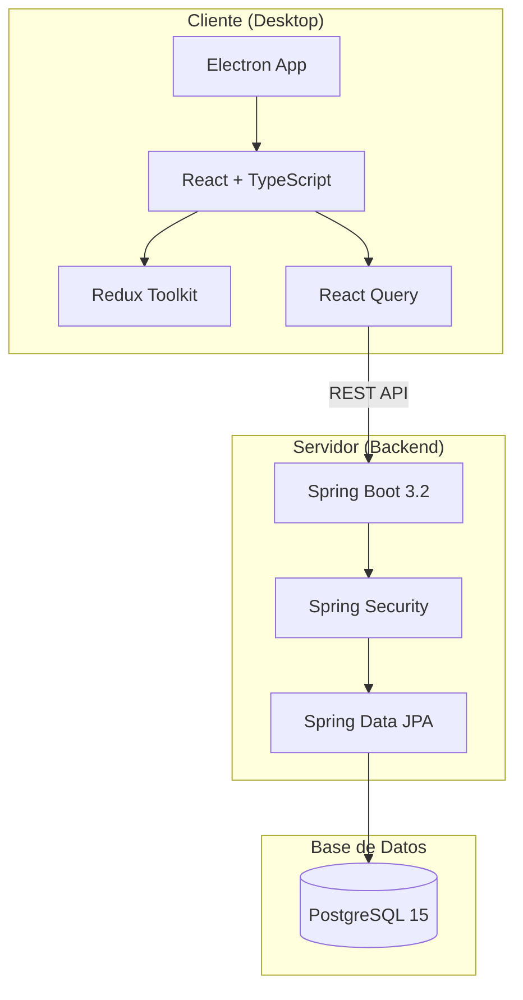
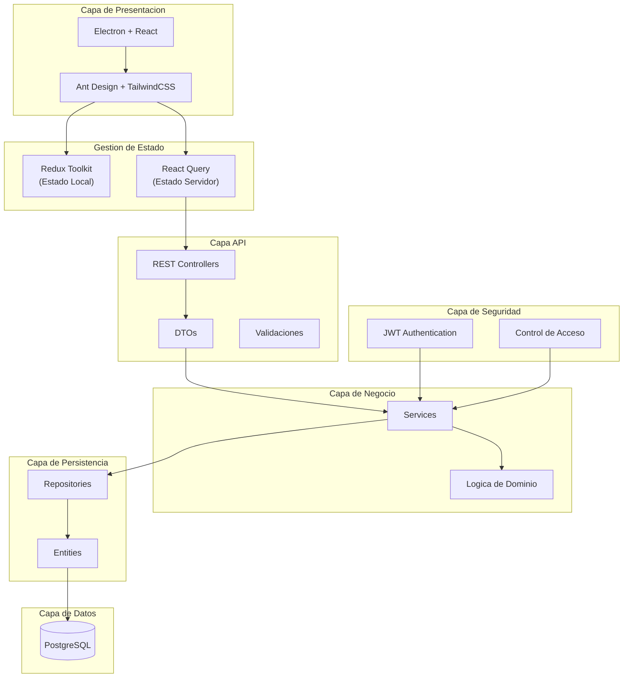
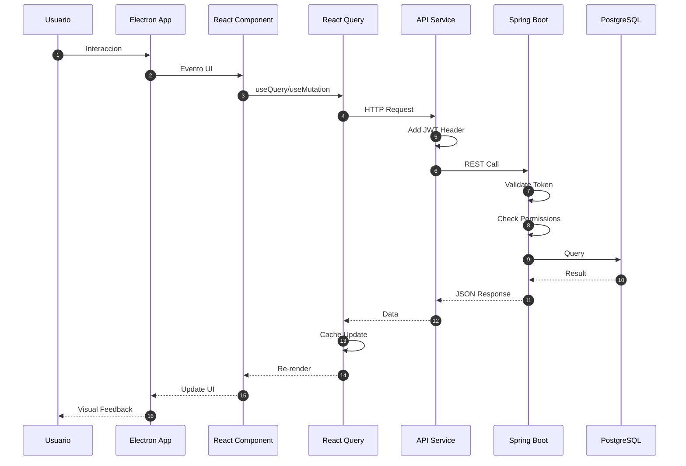
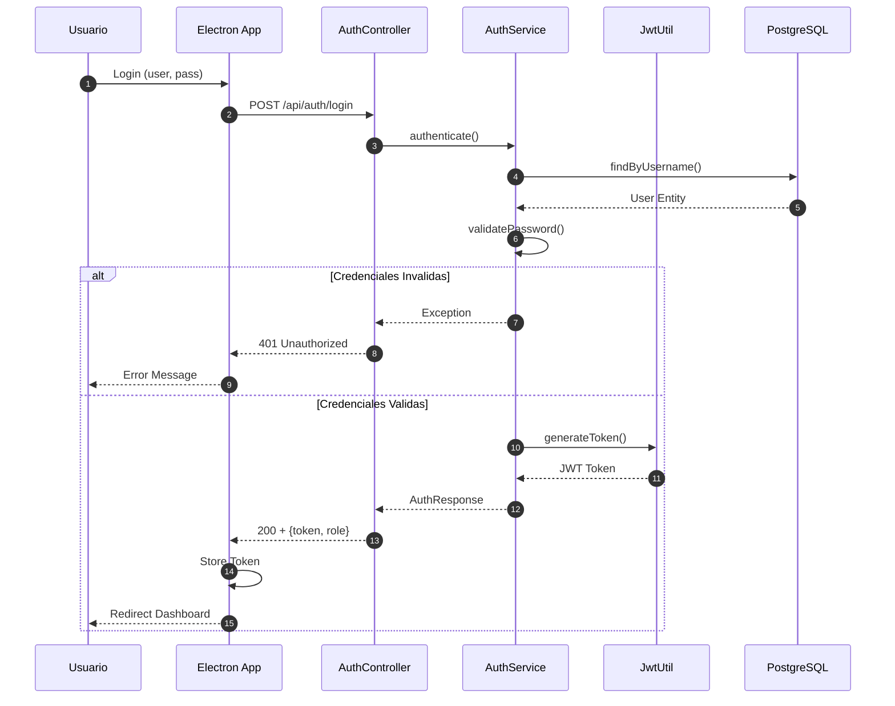
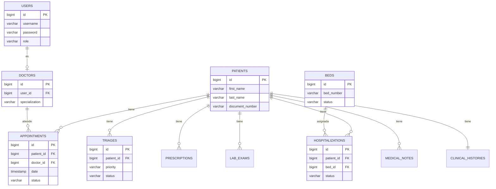
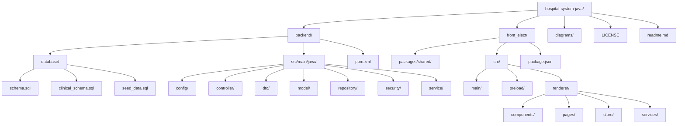
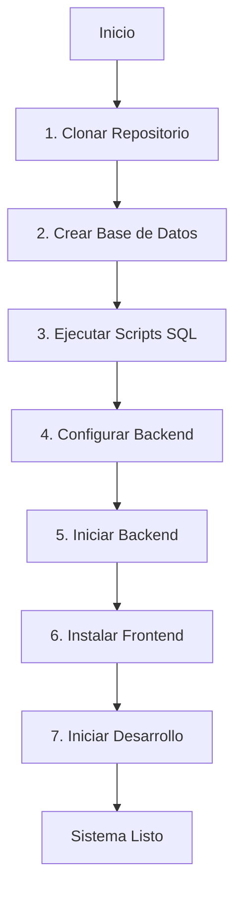
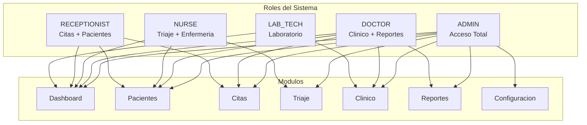

<p align="center">
  
</p>

<h1 align="center">Sistema de Gestion Hospitalaria</h1>

<p align="center">
  Plataforma integral para la administracion clinica y operativa de centros de salud
</p>

<p align="center">
  
  
  
  
  
</p>

<p align="center">
  <a href="https://github.com/Yonsn76/hospital-system-java">
    
  </a>
  
  
</p>

---

## Tabla de Contenidos

- [Descripcion](#descripcion)
- [Caracteristicas](#caracteristicas)
- [Arquitectura](#arquitectura)
- [Stack Tecnologico](#stack-tecnologico)
- [Estructura del Proyecto](#estructura-del-proyecto)
- [Requisitos](#requisitos)
- [Instalacion](#instalacion)
- [Documentacion](#documentacion)
- [Licencia](#licencia)

---

## Descripcion

Esta plataforma integral de gestion hospitalaria moderniza la administracion clinica y administrativa de instituciones de salud. Su objetivo principal es salvaguardar la integridad del paciente mediante la prevencion automatizada de errores medicos y optimizar la asignacion de recursos criticos como camas y quirofanos.

Al centralizar la informacion, facilita la toma de decisiones informadas y garantiza el cumplimiento normativo mediante un registro inmutable de todas las actividades realizadas por el personal.

---

## Caracteristicas

### Gestion Clinica

| Modulo | Descripcion |
|--------|-------------|
| Pacientes | Registro completo, busqueda avanzada, historial medico |
| Citas Medicas | Programacion, confirmacion, seguimiento de estados |
| Triaje | Clasificacion por prioridad, cola de atencion |
| Historia Clinica | Expediente electronico, antecedentes, alergias |
| Notas Medicas | Consultas, evoluciones, interconsultas |
| Prescripciones | Recetas medicas con control de estado |
| Laboratorio | Solicitud y seguimiento de examenes |
| Derivaciones | Referencias a especialistas |

### Gestion Administrativa

| Modulo | Descripcion |
|--------|-------------|
| Hospitalizacion | Ingresos, altas, transferencias |
| Gestion de Camas | Disponibilidad, asignacion por area |
| Archivos Clinicos | Documentos digitales, auditoria de accesos |
| Control de Accesos | Roles y permisos granulares |
| Reportes | Estadisticas, productividad, exportacion PDF/Excel |

### Funcionalidades Generales

| Caracteristica | Descripcion |
|----------------|-------------|
| Autenticacion JWT | Tokens seguros con expiracion configurable |
| Multirol | Admin, Doctor, Enfermera, Recepcionista, Laboratorio |
| Tema Claro/Oscuro | Interfaz personalizable |
| Multiplataforma | Windows, macOS, Linux |
| Tiempo Real | Dashboard con metricas actualizadas |

---

## Arquitectura

### Diagrama General del Sistema



### Arquitectura por Capas



### Comunicacion Frontend-Backend



### Flujo de Autenticacion



### Modelo de Datos (Simplificado)



---

## Stack Tecnologico

### Backend

| Tecnologia | Version | Proposito |
|------------|---------|-----------|
| Java | 17 LTS | Lenguaje principal |
| Spring Boot | 3.2.3 | Framework backend |
| Spring Security | 6.x | Autenticacion y autorizacion |
| Spring Data JPA | 3.x | Persistencia de datos |
| PostgreSQL | 15+ | Base de datos relacional |
| JWT | - | Tokens de autenticacion |
| Maven | 3.8+ | Gestion de dependencias |
| iText 7 | 7.2.5 | Generacion de PDFs |
| Apache POI | 5.2.5 | Generacion de Excel |

### Frontend

| Tecnologia | Version | Proposito |
|------------|---------|-----------|
| Electron | 31.0.0 | Framework desktop |
| React | 18.3.1 | Libreria UI |
| TypeScript | 5.5.0 | Tipado estatico |
| Vite | 5.4.0 | Build tool |
| Redux Toolkit | 2.2.5 | Estado global |
| React Query | 5.60.0 | Server state |
| Ant Design | 5.21.0 | Componentes UI |
| TailwindCSS | 3.4.0 | Estilos utilitarios |
| React Router | 6.26.0 | Navegacion |
| Vitest | 2.0.0 | Testing |

<p align="center">
  
  
  
  
  
  
</p>

---

## Estructura del Proyecto

```
hospital-system-java/
│
├── backend/                          # API REST (Spring Boot)
│   ├── database/                     # Scripts SQL
│   ├── src/main/java/                # Codigo fuente Java
│   └── pom.xml                       # Dependencias Maven
│
├── front_elect/                      # Aplicacion Desktop (Electron)
│   ├── packages/shared/              # Tipos compartidos
│   ├── src/
│   │   ├── main/                     # Proceso principal Electron
│   │   ├── preload/                  # Bridge de seguridad
│   │   └── renderer/                 # Interfaz React
│   └── package.json                  # Dependencias npm
│
├── diagrams/                         # Documentacion tecnica
│   ├── architecture.md               # Diagrama de arquitectura
│   ├── er_diagram.md                 # Diagrama entidad-relacion
│   └── sequence_auth.md              # Secuencia de autenticacion
│
├── LICENSE                           # Licencia MIT
└── readme.md                         # Este archivo
```

### Diagrama de Estructura



---

## Requisitos

### Software Necesario

| Componente | Version Minima | Descarga |
|------------|----------------|----------|
| Java JDK | 17 | [Oracle](https://www.oracle.com/java/technologies/downloads/) / [OpenJDK](https://adoptium.net/) |
| Node.js | 18.0.0 | [nodejs.org](https://nodejs.org/) |
| PostgreSQL | 14 | [postgresql.org](https://www.postgresql.org/download/) |
| Maven | 3.8 | [maven.apache.org](https://maven.apache.org/download.cgi) |
| Git | 2.x | [git-scm.com](https://git-scm.com/downloads) |

### Verificar Instalacion

```bash
java --version
node --version
psql --version
mvn --version
git --version
```

---

## Instalacion

### Diagrama de Instalacion



### 1. Clonar el Repositorio

```bash
git clone https://github.com/Yonsn76/hospital-system-java.git
cd hospital-system-java
```

### 2. Configurar Base de Datos

```sql
-- Crear base de datos
CREATE DATABASE hospital_db;
```

```bash
# Ejecutar scripts de esquema
psql -U postgres -d hospital_db -f backend/database/schema.sql
psql -U postgres -d hospital_db -f backend/database/clinical_schema.sql
psql -U postgres -d hospital_db -f backend/database/seed_data.sql
```

### 3. Configurar Backend

Editar `backend/src/main/resources/application.properties`:

```properties
server.port=2026
spring.datasource.url=jdbc:postgresql://localhost:5432/hospital_db
spring.datasource.username=postgres
spring.datasource.password=tu_password
jwt.secret=tu_clave_secreta_256_bits
```

### 4. Iniciar Backend

```bash
cd backend
mvn clean install
mvn spring-boot:run
```

El servidor estara disponible en: `http://localhost:2026`

### 5. Iniciar Frontend

```bash
cd front_elect
npm install
npm run dev
```

---

## Documentacion

| Documento | Descripcion | Ubicacion |
|-----------|-------------|-----------|
| Backend API | Documentacion completa del API REST | [backend/README.md](backend/README.md) |
| Frontend | Documentacion de la aplicacion Electron | [front_elect/README.md](front_elect/README.md) |
| Arquitectura | Diagrama de arquitectura del sistema | [diagrams/architecture.md](diagrams/architecture.md) |
| Base de Datos | Diagrama entidad-relacion | [diagrams/er_diagram.md](diagrams/er_diagram.md) |
| Autenticacion | Flujo de autenticacion JWT | [diagrams/sequence_auth.md](diagrams/sequence_auth.md) |

---

## Roles del Sistema



| Rol | Codigo | Acceso |
|-----|--------|--------|
| Administrador | ADMIN | Acceso total al sistema |
| Doctor | DOCTOR | Pacientes, citas, notas, recetas, reportes |
| Enfermera | NURSE | Triaje, signos vitales, observaciones |
| Recepcionista | RECEPTIONIST | Pacientes, citas, admisiones |
| Laboratorio | LAB_TECH | Examenes, resultados |

---

## Licencia

Este proyecto esta bajo la Licencia MIT. Consulta el archivo [LICENSE](LICENSE) para mas detalles.

---

<p align="center">
  
  <br/>
  <sub>Desarrollado con Java, Spring Boot, Electron y React</sub>
</p>
